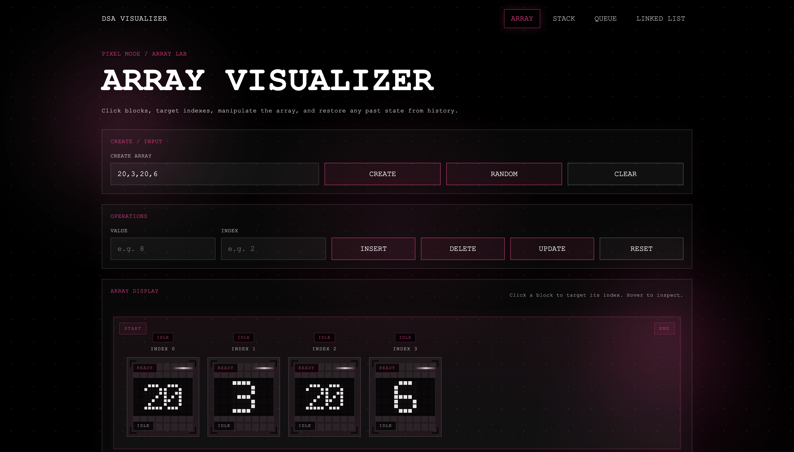
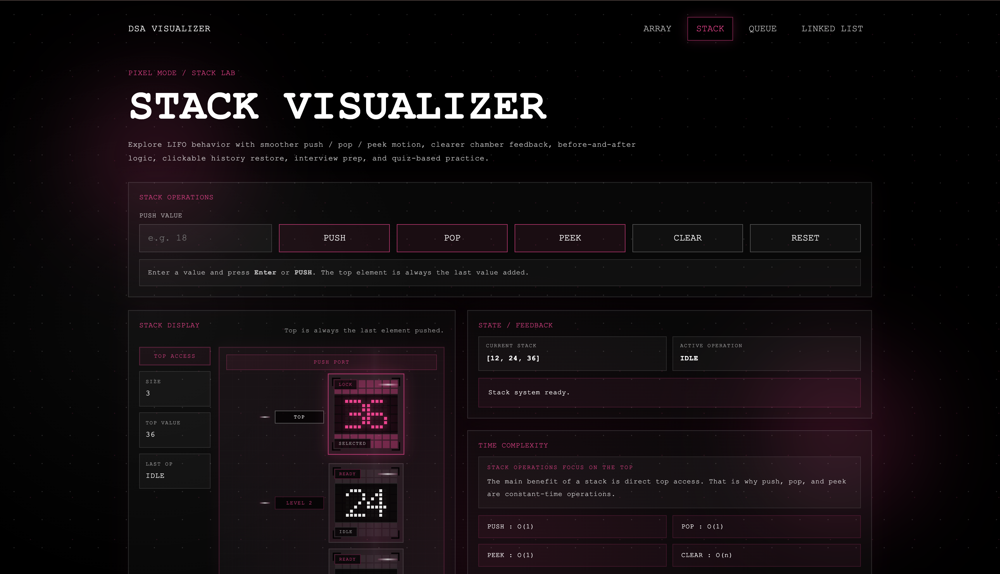

# DSA Visualizer

A visually engaging DSA Visualizer built with React to make core data structures easier to understand through interactive animations, clear visual feedback, and a beginner-friendly learning experience.

## Overview

DSA Visualizer is a learning-focused project designed to help users explore how fundamental data structures work in a more intuitive and interactive way. Instead of relying only on theory, this project turns core operations into visual experiences so learners can better understand what is happening step by step.

The current version includes interactive modules for arrays, stacks, queues, and linked lists, presented through a polished pixel-inspired interface with a strong teaching-oriented UX.

## Features

- Interactive visualizations for core data structures
- Smooth UI interactions and operation feedback
- Beginner-friendly layout and learning flow
- Pixel-inspired visual design system
- Modular architecture for future DSA expansion
- Separate frontend and backend setup

## Modules Completed

- Array Visualizer
- Stack Visualizer
- Queue Visualizer
- Linked List Visualizer

## Tech Stack

### Frontend
- React
- Vite
- JavaScript
- CSS

### Backend
- Node.js
- Express

## Project Structure

```bash
dsa-visualizer/
├── backend/
│   ├── src/
│   │   └── server.js
│   ├── package.json
│   └── package-lock.json
│
├── docs/
│   └── roadmap.md
│
├── frontend/
│   ├── public/
│   ├── src/
│   │   ├── assets/
│   │   ├── components/
│   │   │   ├── array/
│   │   │   ├── linkedlist/
│   │   │   ├── queue/
│   │   │   ├── shared/
│   │   │   ├── stack/
│   │   │   ├── data/
│   │   │   └── utils/
│   │   ├── data/
│   │   ├── utils/
│   │   ├── App.jsx
│   │   ├── App.css
│   │   ├── index.css
│   │   └── main.jsx
│   ├── index.html
│   ├── vite.config.js
│   ├── package.json
│   └── package-lock.json
│
└── README.md

## Live Demo

[View Live Project](https://dsa-visualizer-qw6f3w9j6-rehantambalas-projects.vercel.app/)
## Screenshots




## Deployment Notes (Milestone 11)

- **Frontend (Vercel):** Deploy `frontend/` and set `VITE_API_BASE_URL` to the Render backend URL.
- **Backend (Render):** Use `render.yaml` from repo root. The backend exposes `/api/algorithms`, `/api/sessions`, and `/api/analytics`.
- **MongoDB Atlas migration:** provision a cluster and set `MONGODB_URI` in Render environment variables. Current server is in-memory and ready to swap to Atlas persistence in `backend/src/server.js`.
