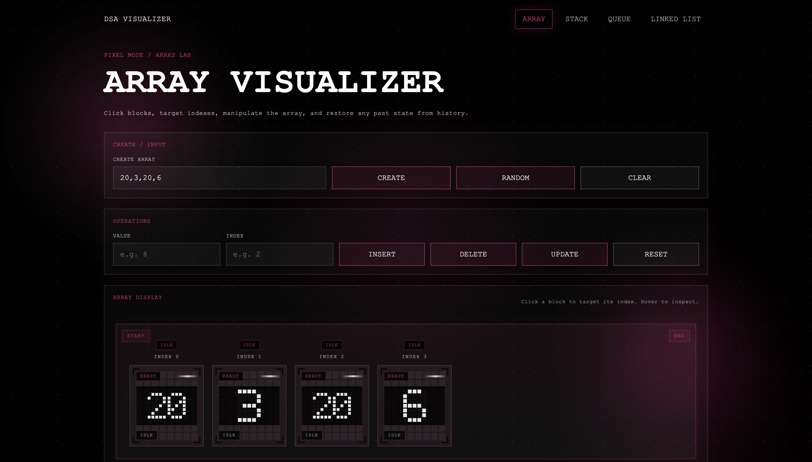
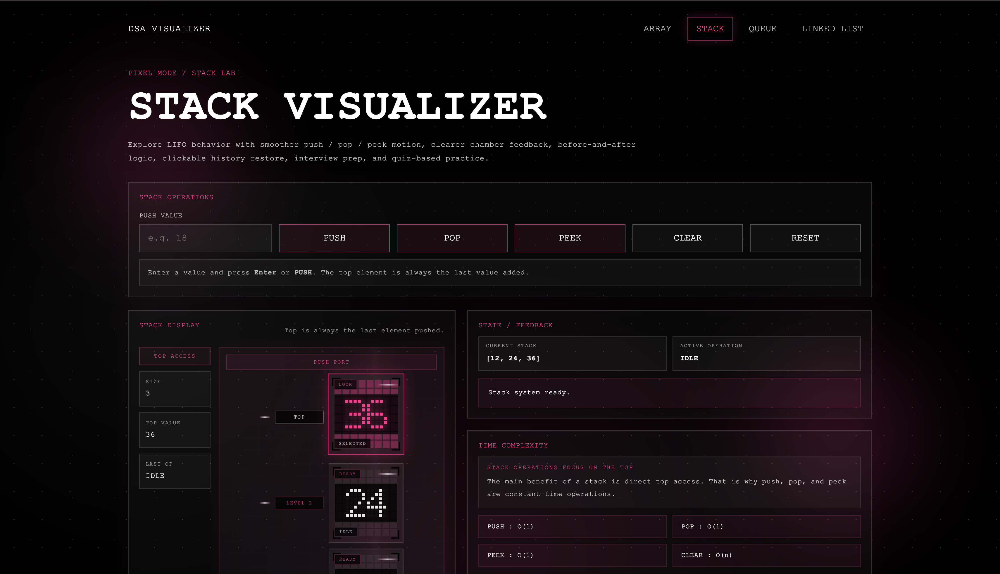

# DSA Visualizer

A full-stack, authentication-gated platform for learning data structures and algorithms through real, interactive execution engines - not canned animations. Every visualizer runs an actual algorithm (real BFS/DFS, real Dijkstra/A*/Greedy, a genuine BST, real sort comparisons/swaps) step by step, with MongoDB-backed persistence and live analytics.

## Overview

DSA Visualizer opens on a branded landing page; entering any module requires signing in (Google Sign-In or a local username/password account) first. Once inside, nine modules cover arrays, stacks, queues, linked lists, sorting, graphs, binary trees, pathfinding, and a live analytics dashboard, all sharing one pixel/cyber visual identity.

The project is built to be technically defensible in a real engineering conversation: deterministic algorithm engines with unit tests, an actual authentication and authorization model (not a demo login), a security-reviewed API, and CI that runs the real test suites and builds on every push.

## Core Features

- **Real algorithm engines, not hardcoded output.** Binary Tree is a genuine BST with real left/right children; Pathfinding runs real Dijkstra/A\*/Greedy Best-First/BFS on an editable, walled grid; Sorting runs real Bubble/Selection/Insertion/Merge/Quick comparisons and swaps; Graph runs real BFS/DFS on a graph you build yourself.
- **A real debugger, not a fixed animation.** Every algorithm module supports play/pause/step forward/step back/auto-play, and history entries actually restore the exact run they represent (grid, graph, or structure state) rather than just resetting the screen.
- **Authentication that behaves like a real product.** HttpOnly-cookie JWT sessions, Google Sign-In verified server-side, CSRF protection, rate limiting, and no account-existence leakage on failed logins - see [Security](#security) below.
- **Persistence with real ownership boundaries.** Saved Linked List simulations are keyed to your actual account when logged in; a guest's browser-local session can never read or overwrite another user's saved state.
- **Live real-time collaboration.** The Linked List visualizer supports a shared session code so two tabs (or two people) can watch the same operations land in real time over Socket.IO.
- **A safe code-to-visualization tracer**, not arbitrary code execution - `/api/execute` parses a small, fixed grammar into visualizer operations. There is no `eval`, no `vm`, and no code execution path on the server at all.
- **Live analytics**, not static numbers - every completed algorithm run is logged to MongoDB and aggregated on the Analytics dashboard, with real loading/empty/error states.
- **A CI pipeline that actually runs** - lint, unit tests, and a production build for both the frontend and backend, on every push and pull request.

## Modules

- Array Visualizer
- Stack Visualizer
- Queue Visualizer
- Linked List Visualizer (live multi-tab sync + DB-backed save/restore)
- Sorting Visualizer (Bubble, Selection, Insertion, Merge, Quick)
- Graph Visualizer (build your own graph, real BFS/DFS, history restores the exact graph/run)
- Binary Tree Visualizer (real BST - insert/delete/search/traversals)
- Pathfinding Visualizer (Dijkstra, A*, Greedy, BFS on an editable walled grid, history restores the exact grid/run)
- Analytics Dashboard (live stats aggregated from every run above)

## Architecture

```
User
 |
 v
React / Vite  (Vercel)
 |  fetch(/api/*)  ---- same-origin, proxied by vercel.json ----> Express API (Render)
 |  Socket.io      ---- direct connection (not proxied)      ---> Socket.io server (Render)
 v
Express (Node.js)
 |-- /api/auth          local + Google auth, HttpOnly cookie sessions
 |-- /api/algorithms    algorithm-run logging (feeds Analytics)
 |-- /api/simulations   save/load Linked List state, ownership-scoped
 |-- /api/execute       grammar-based code-to-visualization tracer
 |-- /api/analytics     aggregate stats
 v
MongoDB (Mongoose)
```

The REST API and the Socket.IO server are two different network paths on purpose: REST calls go through Vercel's edge proxy so the browser only ever talks to its own origin (keeping the login cookie same-site); the Socket.IO connection for Linked List collaboration goes directly to the Render backend, since it doesn't rely on that cookie and can't be proxied the same way. See [Deployment](#deployment) below.

## Frontend Stack

- React 18 + Vite 5
- Plain CSS (design-token-free, pixel/cyber visual system) + Framer Motion for a handful of transitions
- Socket.IO client (Linked List collaboration)
- Vitest 3 for algorithm-engine tests, ESLint (flat config) for linting

## Backend Stack

- Node.js + Express 4
- Mongoose 8 (MongoDB)
- `jsonwebtoken` + `bcryptjs` for local auth, `google-auth-library` for verifying Google ID tokens server-side
- `cookie-parser`, `cors`, `express-rate-limit`
- Socket.IO (Linked List real-time collaboration)
- Jest + Supertest for backend tests

## Authentication

- **HttpOnly-cookie JWT sessions.** The login token is never exposed to JavaScript (so an XSS bug can't read it out of `localStorage`, because it's never put there); the cookie is `SameSite=Lax` and `Secure` in production.
- **CSRF defense in depth.** Every mutating request must carry a custom `X-Requested-With` header, which a plain HTML form can't set and a cross-origin `fetch`/XHR can't set without first triggering a CORS preflight that the origin-locked CORS config already rejects.
- **Google Sign-In is verified server-side.** The frontend never asserts a user's identity - the backend verifies the Google ID token's signature and audience with `google-auth-library` before trusting anything in it.
- **No account-existence leakage.** A failed login returns the same generic message whether the username doesn't exist or the password is wrong.
- **Rate-limited auth endpoints**, and passwords are hashed with bcrypt - never stored or logged in plaintext.
- **Entry is gated.** Landing on the site works without an account; entering any module (or the Analytics dashboard) requires signing in first, either with Google or a local username/password account.
- **Ownership boundaries are enforced server-side**, not just in the UI: a saved Linked List simulation is looked up by the *server's* resolved identity (`user:<id>` for a logged-in caller), never by a client-supplied id that could be guessed or spoofed into someone else's namespace.

## Real-Time Collaboration

The Linked List visualizer's Socket.IO layer uses a shared session-code model (not account-scoped) so two browser tabs can collaborate without both needing accounts. It's still hardened server-side: room ids are validated against a strict pattern, a socket must have actually joined a room before it can broadcast into it, operation payloads are size-capped, and every socket is rate-limited per connection window - so one client can't flood a room or the server, and can't blind-broadcast into a room it never joined.

## Algorithm Engine

Sorting, Graph, Tree, and Pathfinding each have their own deterministic step engine (`frontend/src/algorithms/*StepEngine.js`) that turns an operation into a plain array of steps (`{ visited, frontier, current, path/activeId, message }`), independent of any React rendering. A shared debugger hook (`useAlgorithmDebugger`) drives playback (step forward/back, auto-play, pause) against that array for all three algorithm-driven visualizers, and history entries store what's needed to regenerate the exact same run later - not just a label.

## Code Tracing

`/api/execute` is a "code-to-visualization trace engine," not a code execution engine. Submitted text is parsed against a small, fixed grammar (currently supporting a `LinkedList` with `append`/`prepend`/`delete`) and turned directly into visualizer operations. There is no `eval`, no `vm`, and no arbitrary code execution path - unsupported syntax returns a structured error instead of running anything.

## Analytics

Every completed algorithm run is logged server-side (`POST /api/algorithms`) and aggregated for the dashboard (`GET /api/analytics`): most-used algorithms, average step count per algorithm, and visualizer usage by session. The dashboard has real loading, empty ("no runs logged yet"), and error ("could not reach the backend") states - it doesn't silently render blank.

## Testing

```bash
cd frontend && pnpm test   # 53 tests - sorting/graph/tree/pathfinding step engines
cd backend && pnpm test    # unit tests - auth logic, session-id/ownership resolution (models mocked)
```

The backend unit suite mocks the `User`/`SimulationState` models, so `pnpm test` never needs a real database. A separate live-database integration suite exercises the real flow - register, duplicate-registration rejection, login, save, read-back, and two different cross-user isolation checks (an unauthenticated guess and a second authenticated account) - against an actual MongoDB instance:

```bash
cd backend
RUN_INTEGRATION=true MONGO_URI="your-connection-string" JWT_SECRET=any-string \
  npx jest liveDb.integration --runInBand
```

Point this at a scratch/dev database, not production - it creates and cleans up disposable `itest_`-prefixed accounts. CI does not run it, since that needs real database credentials CI doesn't have.

## Security

Beyond the authentication points above: CORS is origin-locked to `FRONTEND_ORIGIN` (not a bare, wide-open `cors()`); `/api/execute`, `/api/algorithms`, and `/api/auth` are rate-limited; input is validated server-side on registration/login (username shape, password length) and on the code tracer (length caps, statement caps, strict grammar); errors return safe, generic messages rather than leaking stack traces; `.env` files are git-ignored everywhere and only `.env.example` templates are committed.

## Deployment

- **Frontend (Vercel):** deploy `frontend/`. `frontend/vercel.json` rewrites `/api/*` to the Render backend at Vercel's edge, so REST calls stay same-origin from the browser's point of view (this is what keeps the `SameSite=Lax` login cookie working in production - a direct cross-origin call to the Render URL would silently drop it). **Do not set `VITE_API_BASE_URL` in production** - leaving it unset is what routes REST calls through that proxy. Set `VITE_SOCKET_URL` to the Render backend URL instead; Socket.IO can't go through the same proxy and needs the real origin directly (it doesn't rely on the cookie, so this is safe).
- **Backend (Render):** use `render.yaml` from the repo root. Required environment variables (set in Render, never committed):
  - `MONGO_URI` - MongoDB connection string. The code and `render.yaml` both read `MONGO_URI`, not `MONGODB_URI`.
  - `FRONTEND_ORIGIN` - the deployed frontend origin, used for CORS. Defaults to `http://localhost:5173` locally.
  - `JWT_SECRET` - required; the server refuses to start without it.
  - `GOOGLE_CLIENT_ID` - optional; enables Google Sign-In when set (must match the frontend's `VITE_GOOGLE_CLIENT_ID`).
  - `PORT` - defaults to `4000`.

## Local Development

Both apps are pinned to `pnpm@12.6.0` (see each `package.json`'s `packageManager` field).

```bash
# backend
cd backend
cp .env.example .env   # fill in MONGO_URI at minimum
pnpm install
pnpm dev                 # http://localhost:4000

# frontend (separate terminal)
cd frontend
cp .env.example .env   # optional - defaults work for local dev
pnpm install
pnpm dev                  # http://localhost:5173
```

## Environment Variables

| File | Variable | Required | Purpose |
|---|---|---|---|
| `backend/.env` | `MONGO_URI` | yes | MongoDB connection string |
| `backend/.env` | `JWT_SECRET` | yes | Signs session cookies; server won't boot without it |
| `backend/.env` | `FRONTEND_ORIGIN` | prod | CORS allow-list; defaults to `http://localhost:5173` |
| `backend/.env` | `PORT` | no | Defaults to `4000` |
| `backend/.env` | `GOOGLE_CLIENT_ID` | no | Enables Google Sign-In server-side verification |
| `frontend/.env` | `VITE_API_BASE_URL` | no | REST base URL - **leave unset in production**, see Deployment |
| `frontend/.env` | `VITE_SOCKET_URL` | prod | Socket.IO backend URL (defaults to `http://localhost:4000` locally) |
| `frontend/.env` | `VITE_GOOGLE_CLIENT_ID` | no | Enables the Google Sign-In button |

## CI

`.github/workflows/ci.yml` runs on every push and pull request: frontend lint + unit tests + production build, and backend unit tests. It does not run the live-database integration suite (see Testing above).

## Live Demo

[dsa-visualizer-qw6f3w9j6-rehantambalas-projects.vercel.app](https://dsa-visualizer-qw6f3w9j6-rehantambalas-projects.vercel.app/) - note: this is a Vercel preview-deployment URL and may require being logged into the project's Vercel account to view; it is not guaranteed to reflect the current `main` branch.

## Screenshots




## Roadmap

Not yet built (tracked deliberately as future work, not implied as done above):
- A personal "My Progress" / account-scoped learning history (current Analytics is site-wide, not per-user)
- Further breakup of the largest visualizer components (Linked List, Queue, Sorting), which currently hold significant logic in one file each
- A broader accessibility pass and a design-token pass over the global stylesheet

## License

MIT - see [LICENSE](./LICENSE).
